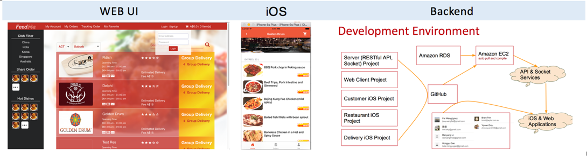

I am Fei Wang, a graduate Master of Computer Science student majoring in Computing in Australia National University (ANU). My undergraduate major was chemical engineering and technology, but I started my IT journey in July 2009 when I was asked to design and code a chemical data processing and management system.

I have three years work experience of system maintenance and support. I had worked on a telecom billing system as deployment and maintenance engineer for three years at ZTEsoft. This complex real-time system runs on 6 UNIX servers and 20 Linux servers. My work was to deploy, test, routinely maintain and remotely upgrade systems using SSH. This work polished my knowledge of UNIX/Linux, Shell, computer network, Java, Python, SQL, Oracle Database and the Web. B

I also leaded a deploy team to work on the Bangladesh Internal Exchange and International Gateway billing project. Our team successfully complete this project and got the provisional acceptance certificate (PAC) from customers two months ahead the deadline, which benefit our company a lot.

During past year, I have managed a team who were developing an online food booking and delivery application named FeedMe. Technics such as Java, swift (IOS), JavaScript, Socket, RESTful API, Bootstrap, JS and HTML etc. were involved in the project. Besides project management, designing the software structure and programming the core functions, I implemented and maintained our RESTful web APIs on Amazon EC2. The following pictures display our achievements.

I was studying large scale data process and machine learning in ANU. To improve my knowledge of computer science, I completed the courses of relation database, algorithm, software construction, model driven software development and project management, computer network, artificial intelligent, statistic machine learning and document analyzing.

In order to keep technology competitiveness, I am learning and keep tracking the following technics.

*	Data processing: Spark, Cassandra, MongoDB, Hadoop.
*	Web development: Spring boot, Python, Bootstrap, JQuery, Nodejs(Express), Meteor, flask.
*	Program language: Java, Python (in science and AI subjects), JavaScript, Scala,
*	Develop, test, deploy environment and tools:  Docker, Linux/Unix (Ubuntu, Suse, Mac), Amazon EC2, git, maven, sbt.

Most of my works are hosted on Github: <a href="https://github.com/jevy-wangfei">https://github.com/jevy-wangfei</a>.

You also can follow this link to view <a href="./pdf/CV_2016_07.pdf">My CV</a>
