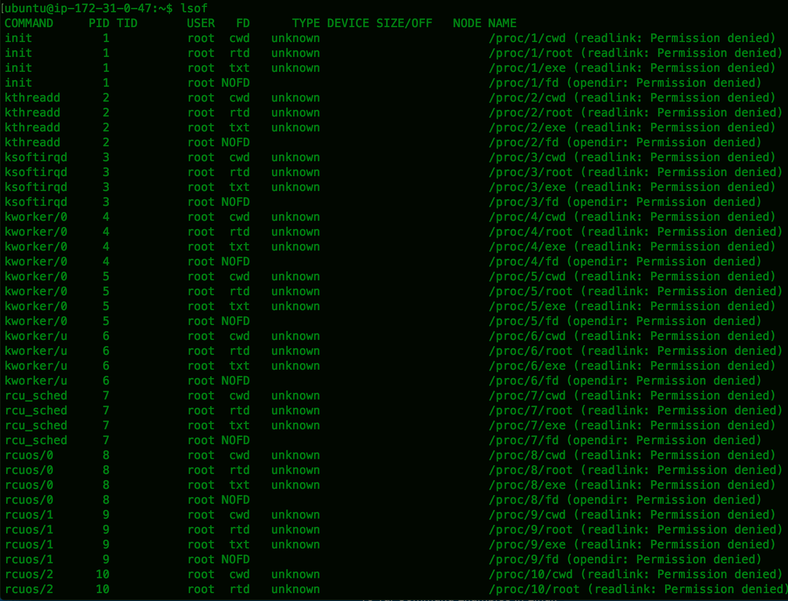

-----------------
The Answers to Instaclustr Technical Test - Graduates

-- By Fei Wang (jevy.wangfei@gmail.com)

Working Log:
* March 09, 2 hours (9:30 pm - 11:30 pm), Bash scripting and General Programming
* March 10, 2 hours (9:00 pm - 11:00 pm), Cloud Computing Theory, Networking Theory, Memory Management
* March 11, 5 hours (3:00 pm - 5:30 pm, 9:00 - 11:30), General Administration, Using Cassandra, SQL Programming
* March 12, 3 hours (11:00 pm - 02:00 am) General Administration, Concurrency Programming
* March 13, 3.5 hours (11:00 am - 01:00 pm, 10:30 - now) Concurrency Programming
Total: 15.5 hours

My apology for I could just spend several hours a day on this test. Because on-going part-time works and freelancer projects took too much of my time. I hope my response to these questions satisfies you.
-----------------

## 1. Bash Scripting
* `./1_recursive_files_words_counter.sh` to view result.
* `./1_letters_frequency_hist.sh` to display hist.

## 2. General Administration
* Logon server using command `ssh -i instaclustr-test-key.pem -p 2222 ubuntu@54.153.65.206`
* Execute `nmon` and type `c`, `m`, `k`, `n` and `d` to monitor CPU usage, memory usage, kernal info, network, and disk read/write.

The CPU usage, memory usage, kernal info, network, and disk read/write are normal.
`Type `c`, `m`, `k`, `n` and `d` again to hidden these information.`
* Type `j` and `t` to monitor file system and top processes.


> **Problem:** filesystem `dev/xvda1`, which mount on `/`, is used 94%. This system could easily use up storage shortly. Administrator has to either moving backup to other place, removing unused data or increasing the size of storage.

* Type `r` to view system resources


> **Problem:** From the system information, I find that the OS(Ubuntu) version is 14.04 LTS with kernel v3.13. It maybe not a problem. However, keeping your system up to date could lower the risk of being hacked and could utilize the new features/techniques adopted by the new OS.

* Execute `lsof`

Execute `cd /process | ls -ltr`


> **Problem:** The target directories, which these soft links point to, are missing.

* Execute `date` to check system time. I find the system time is incorrect.
Execute `ps -ef|grep ntpd` to lookup ntpd process

> **Problem:** System time is incorrect and `ntpd` process is not running.


* Execute `netstat -l` to check openning port


## 3. General Programming
* `javac GeneralProgramming.java` to compile.
* `java -cp . GeneralProgramming` to run it.

## 4. Concurrency Programming
* Code is located in directory MultiThreadStatician
* `make all` to compile and run the program
* `make clean` to remove generated classes

## 5. SQL Programming
* List the title, release year, genre and director of all  **'action'**  movies.
```sql
SELECT m.title, m.release_year, m.genre, m.director FROM movies m
where m.genre = "action";
```
* List the actors and their birth year for all movies directed by  **'Wes Anderson'** .
```sql
SELECT a.name, a.birth_year FROM actors a inner join  movie_cast c inner join movies m  
  on a.name=c.actor
    and a.birth_year = c.birth_year
    and c.movie = m.title
    and c.movie_release_year = m.release_year
    and m.director = "Wes Anderson";
```

```sql
SELECT c.actor, c.birth_year FROM  movie_cast c inner join movies m  
  on c.movie = m.title
  and c.movie_release_year = m.release_year
  and m.director = "Wes Anderson";
```
* List the title, release year, genre and director of all movies staring  **'Jeff Goldblum'** but not  **'Bruce Willis'** .
```sql
select m.title, m.release_year, m.genre, m.director from movies m inner join (
        select a.movie as title, a.movie_release_year as release_year from movie_cast a
        where a.actor = "Jeff Goldblum" and not exists (
              select * from movie_cast b
              where a.movie=b.movie and a.movie_release_year=b.movie_release_year
                and b.actor = "Bruce Willis")
        ) s
on m.title=s.title and m.release_year = s.release_year;
```

## 6. Using Cassandra
* Create an Instaclustr account and wait until Instaclustr finishing Cassandra joining.
* Download Cassandra v3.10, unpress it and `cd` to `apache-cassandra/bin` directory in terminal.
* Use connection information provided on `interviewTest (Cluster Dashboard)/Connection Info` and `https://support.instaclustr.com/hc/en-us/articles/216238308` to connect Cassandra:

```bash
./cqlsh 52.24.8.111  9042 –u iccassandra -p b13e656dbbd8762b645e314914a4165f
```
 (Instaclustr automatically adds my public to allowed addresses list of cluster's firewall)

* Create keyspace:
```sql
create keyspace moviecategory with replication = {'class':'SimpleStrategy','replication_factor':3};
```


```sql
use moviecategory;
```


* Create table:
```sql
CREATE TABLE movies (
	title text,
	release_year int,
	genre text,
	director text,
	PRIMARY KEY (title, release_year)
);
```


* Load data:
```sql
COPY movies FROM ('instaclustr/movies.csv') WITH DELIMITER=',' AND HEADER='true';
```


## 7. Cloud Computing Theory
### 7.1 What is the difference between container based virtualization and hypervisor based virtualization?
The difference between Container based virtualization (using `C` in short) and Hypervisor based virtualization (using `H` in short) are listed as following:
* Different virtual ideas: `H` 'creates' virtual hardware on host OS, and the virtual machine just like physical computer. But virtualization of `C` is done at its OS level instead of at hardware level.
* Resource sharing: `H` doesn't share any computing resources with other. But `C` shares host's kernel with other Containers.
* Performance: With the increase of more `H` created on host server, the performance of each `H` will be impacted greatly.  However, because of sharing resources, the busier `C` can get more resources than quite ones.


### 7.2 In Amazon Web Services, explain the difference between a Region, Availability Zone and Instance in relation to fault domains.
* A physical place where hosts Amazon services is called `Region`. `Regions` are separated geography world-widely. Amazon has about ten regions available: three in US, and others spread over Europe, Asia, Pacific and South America. Different  `Regions` allows resources provided by Amazon closer to customer. `Regions` are isoloated, and Amazon doesn't replicate resources across regions automatically.
* In each `Region`, there are multiple, isolated locations called `Availability Zones`. `Availability Zones` are connected through low-latercy links.
* An instance, similar to a server, runs in specific `Availability Zones`.
Two pictures from AWS documentation may explain these concept clearly than words:


* Ref. http://d263e6mrqtw8qn.cloudfront.net/blog/wp-content/uploads/2014/06/aws_regions.png
* Ref. http://docs.aws.amazon.com/AWSEC2/latest/UserGuide/images/aws_regions.png
* Ref. http://docs.aws.amazon.com/AWSEC2/latest/UserGuide/using-regions-availability-zones.html


## 8. Networking Theory
* In order to make at least 64 subnets, the subnet bits should be 6 or larger. So, the subnet at least should be 255.252.0.0, or /14 in CIDR.
* NAT (Natwork Address Translation): Map internal private addresses and their port to public addresses (public addresses come from a public address pool) with their ports not changed.
* PAT (Port Address Translation): Map internal private addresses and their ports to a public address with different ports.  
* VPN (Virtual Private Network): VPN is a technology which creates a security private connection over a public  network. Besides security, VPN also allow people remotely access resources available within a private network.

## 9. Memory Management
**Difference between CMS and G1GC**
* Compacting: Both CMS and G1GC will enter "Stop the World" (STW). G1GC can compact the heap on the go. However, CMS only compacts during full STW collections.
* Pausing time: Both CMS and G1GC will pause application threads when. CMS takes longer pausing time than G1GC, because CMS has to scan entire heap, but G1GC can limit its scanning to specific regions.
* Throughput: In average, CMS spend less time on GC than G1GC.
* Usage: Turn on CMS using parameter XX:+USeParNewGC. Turn on G1GC using parameter -XX:+UseG1GC
**When to use CMS or G1GC**
* In general, CMS suitable for heap size of less than 4GB, and G1GC better support heaps larger than 4GB. G1GC is suitable the freeze sensitive application, and CMS suitable for large throughput application.

However, in real practice, we should analysis and measure our own application and machines to choose right GC collector.

* Ref. https://plumbr.eu/blog/garbage-collection/g1-vs-cms-vs-parallel-gc
* Ref. http://javapapers.com/java/types-of-java-garbage-collectors
* Ref. https://blogs.oracle.com/vikram/entry/garbage_first_3_differences_between
